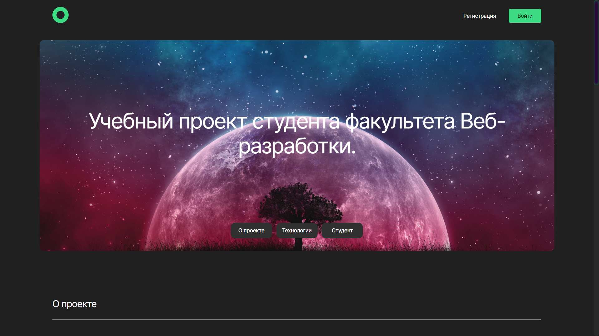
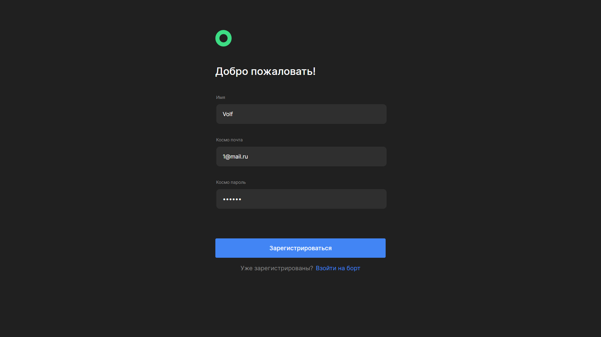
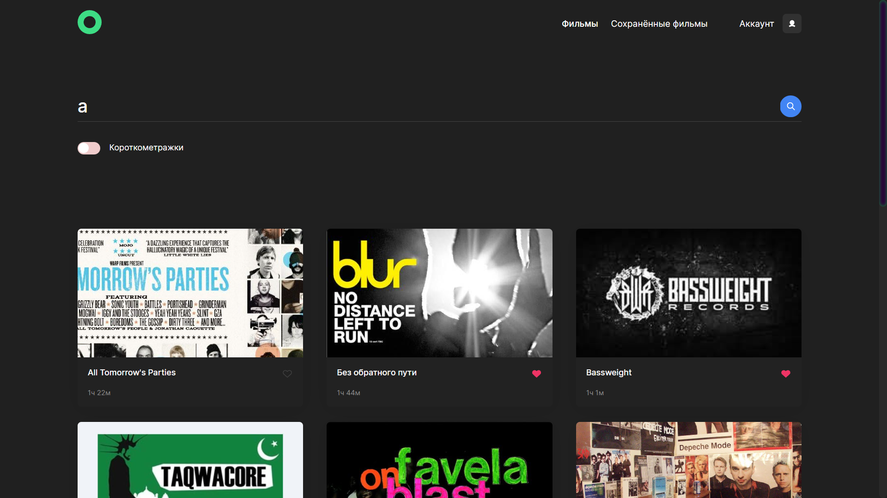
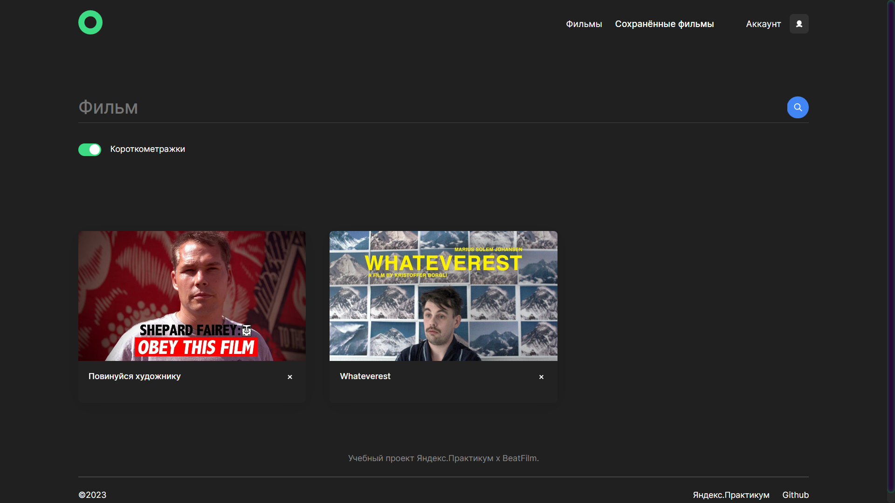
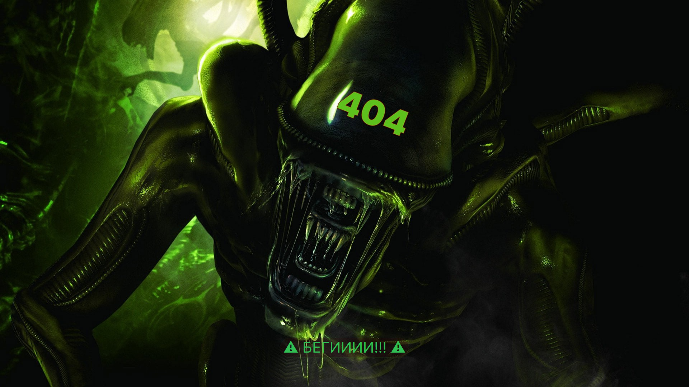
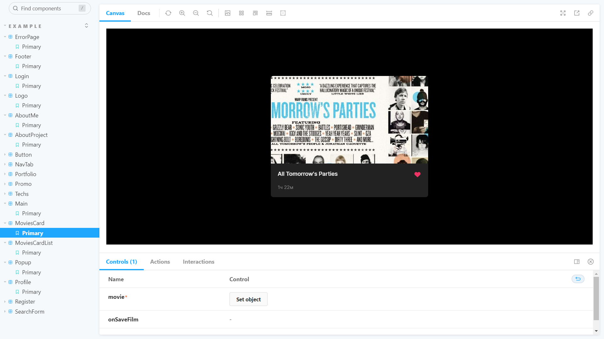

# Movies-explorer-refactor

## Pet-project

### За основу взят мой дипломный проект movies-explorer. Шаг за шагом я буду проводить рефакторинг и использовать всё более и более сложные технолоии и новый стек.

---
### Проект представляет собой сайт для поиска, обзора и сохранения фильмов. В проекте присуствует регистрация, авторизация, главная страница, и две страницы: поиск по фильмам и сохранённые фильмы.

## Backend часть данного проекта находится по ссылка: [https://github.com/ChernoSlava/movies-explorer-api.git](https://github.com/ChernoSlava/movies-explorer-api.git)
---
### **Author** - Junior Frontend Developer `Вячеслав Черногоров`.
### **Teacher and Reviewer** - Senior Frontend Developer `Алексей Абретов`.
---

## Технологический стек
- HTML5: семантические теги,
- CSS 3: медиа-запросы,
- JavaScript: React,
- React hooks,
- Higher-Order Components,
- Storybook,
- Styled Components,
- ESLint
- TypeScript;
---

## Предпросмотр проекта

### Стартовая страница

  

### Страница авторизации

  

### Страница регистрации

  

### Страница поиска фильмов

  

### Страница поиска cохраённых фильмов с фильтром

  

### Страница 404

  

### Страница storybook

  

---

## Установка и запуск

Требования:

* npm >= 6.14;

* Node js

* MongoDB

### Запуск:

#### Для запуска проекта нужно установить репозиторий с Backend частью. 
1. Для этого на локальном компьютере выполните команду: 

- `git clone https://github.com/ChernoSlava/movies-explorer-api.git` - Для копирования проекта на локальный пк по https;

2. После этого в консоли нужно выполнить: 

- `npm i` - Для установки зависимостей;

3. Следующим шагом локально запускаем backend 
Для этого в терминале вводим команду:

- `npm run dev`;

#### После запуска сервера приступаем к установке репозитория с Frontend частью

1. Для этого на локальном компьютере выполните команду: 

- `git clone https://github.com/ChernoSlava/Movies-exlorer-refactor.git` - Для копирования проекта на локальный пк по https;

2. После этого в консоли нужно выполнить: 

- `npm i` - Для установки зависимостей;

3. Для использования:

- `npm start` - Команда для запуска проекта;
- `npm run build` - Для сборки проекта;
- `npm run eslint` - Для проверки ошибок через ESLint;
- `npm run storybook` - Для проверки и рефакторинга компонентов без запуска приложения;

---
## Задача по рефакторингу
### Level-1 - Подключить ESLint и перевести проект на Styled component ( Доп.-использовать звуковые эффекты )
### Level-2 - Сделать декомпозицию проекта ( Разделить логику и компоненты, подключить Storybook )
### Level-3 - Перевести проект на TypeScript
### Level-4 - Заменить use Context на Redux 

--- 
## Основные ссылки
### Оригинальный макет проекта https://disk.yandex.ru/d/69oaThBQQpratA
### Ссылка на github frontend части [frontend](https://github.com/ChernoSlava/Movies-exlorer-refactor)
### Ссылка на github оригинальной frontend части [frontend-origin](https://github.com/ChernoSlava/movies-explorer-frontend)
### Ссылка на github backend части [backend](https://github.com/ChernoSlava/movies-explorer-api)

## Ссылки на другие проекты
### Проекты созданные при обучении Яндекс.Практикум

1) [Статичный сайт Путешествие по России.](https://chernoslava.github.io/russian-travel/)
2) [Репозиторий проекта Место на чистом js.](https://github.com/ChernoSlava/Mesto)
3) [Репозиторий полноценного доработанного проекта Место Frontend и Backend.](https://github.com/ChernoSlava/react-mesto-api-full)
4) [Дипломный проект Movies explorer](https://github.com/ChernoSlava/movies-explorer-frontend)

### Проекты созданные при обучении и менторстве senior web developer Абретова А.

1) [Counter](https://github.com/ChernoSlava/counter)
2) [Counter-temperature](https://github.com/ChernoSlava/counter-temperature)
3) [ToDo list](https://github.com/ChernoSlava/ToDo)
4) [Contacts keeper](https://github.com/ChernoSlava/contacts-keeper)
4) [Fish gallery](https://github.com/ChernoSlava/fish-gallery)
5) [Рефакторинг дипломного проекта Movies explorer](https://github.com/ChernoSlava/Movies-exlorer-refactor)
---
